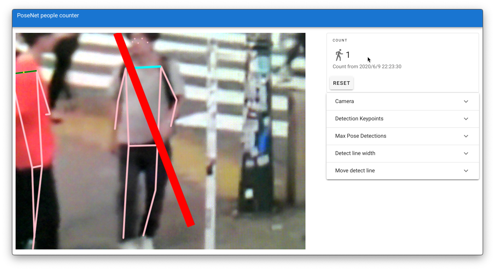
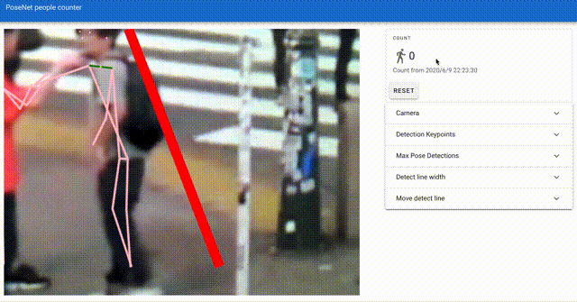
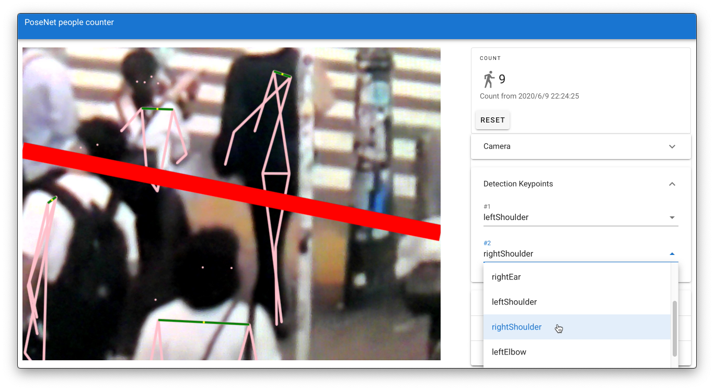
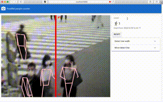
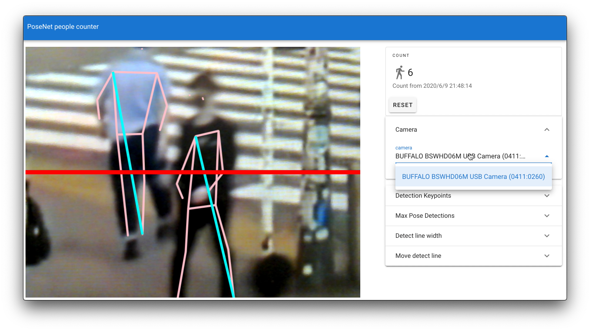
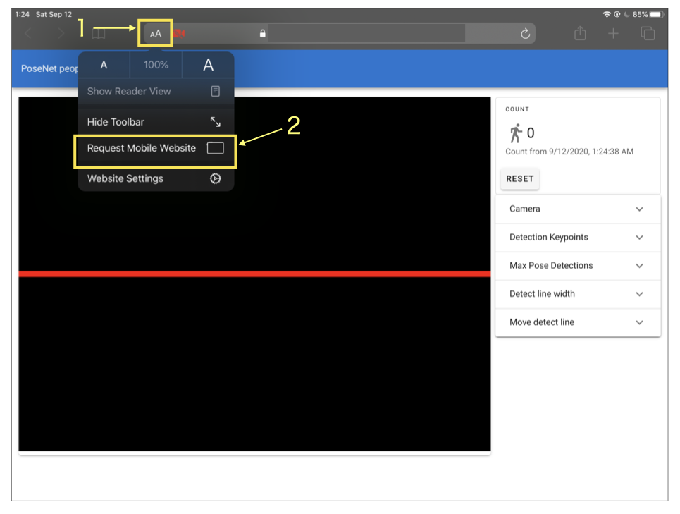

# PoseNet people counter

[](https://github.com/nekodango/PoseNet-Vue-people-counter/actions?query=workflow%3A%22github+pages%22)

## Overview
People counter running on a web browser using [PoseNet](https://github.com/tensorflow/tfjs-models/tree/master/posenet), [Vue.js](https://vuejs.org/), [Vuetify](https://vuetifyjs.com/).




Code for the most part is directly from [PoseNet official demos](https://github.com/tensorflow/tfjs-models/tree/master/posenet/demos) and [xunxdd/Posenet-Demo--In-My-Feelings-Challenge-AI](https://github.com/xunxdd/Posenet-Demo--In-My-Feelings-Challenge-AI).


## Live demo
Try it on your device now!
https://nekodango.github.io/PoseNet-Vue-people-counter/


## Settings
You can change settings interactively.

### Detection Keypoints
You can select two keypoints from below.
 - nose
 - leftEye
 - rightEye
 - leftEar
 - rightEar
 - leftShoulder
 - rightShoulder
 - leftElbow
 - rightElbow
 - leftWrist
 - rightWrist
 - leftHip
 - rightHip
 - leftKnee
 - rightKnee
 - leftAnkle
 - rightAnkle
 



### Line width and position


### Select Camera


## Running on Mobile Device
#### iOS/Safari
Use "Request Mobile Website" to change Rear camera.



## Project setup
```
npm install
```

### Compiles and hot-reloads for development
```
npm run serve
```

### Compiles and minifies for production
```
npm run build
```

### Lints and fixes files
```
npm run lint
```

### Customize configuration
See [Configuration Reference](https://cli.vuejs.org/config/).
