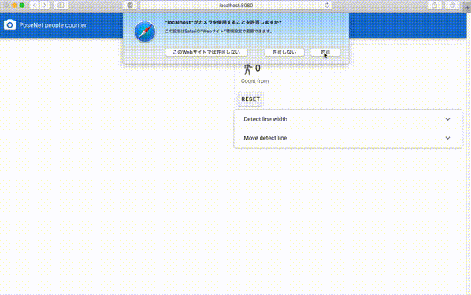

# PoseNet people counter


## Overview
People counter running on a web browser using [PoseNet](https://github.com/tensorflow/tfjs-models/tree/master/posenet), [Vue.js](https://vuejs.org/), [Vuetify](https://vuetifyjs.com/).


Code for the most part is directly from [PoseNet official demos](https://github.com/tensorflow/tfjs-models/tree/master/posenet/demos) and [xunxdd/Posenet-Demo--In-My-Feelings-Challenge-AI](https://github.com/xunxdd/Posenet-Demo--In-My-Feelings-Challenge-AI).

## Live demo
Try it on your device now!
https://nekodango.github.io/PoseNet-Vue-people-counter/

## Configure detect line
Detect line width and position can be changed interactively.


## Project setup
```
npm install
```

### Compiles and hot-reloads for development
```
npm run serve
```

### Compiles and minifies for production
```
npm run build
```

### Lints and fixes files
```
npm run lint
```

### Customize configuration
See [Configuration Reference](https://cli.vuejs.org/config/).
